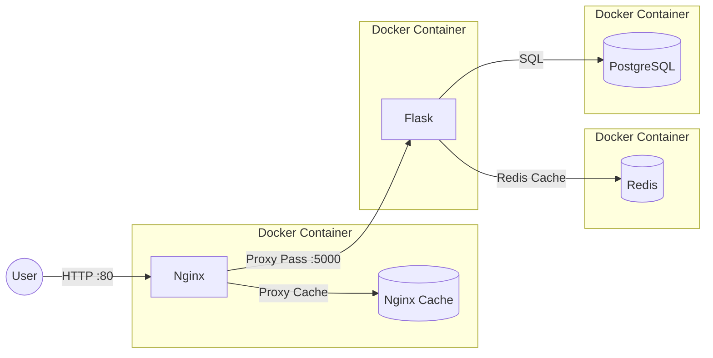

# Flask CRUD App with Docker, Nginx & Redis Caching

Полноценное CRUD-приложение на **Flask**, развернутое в контейнерах **Docker**. Проект реализует двухуровневое кэширование (Nginx + Redis), работает с базой данных **PostgreSQL**.

Проект разработан с использованием [admin-starterpack](https://github.com/bob4inski/admin-starterpack), но расширен функционалом для выполнения полноценного технического задания.

## Содержание

- [Архитектура](#-архитектура)
- [Технологический стек](#-технологический-стек)
- [Функциональные возможности](#-функциональные-возможности)
- [Быстрый старт](#-быстрый-старт)
- [API Документация](#-api-документация)
- [Нюансы реализации](#-нюансы-реализации)
  - [Двухуровневое кэширование](#двухуровневое-кэширование)
  - [Инвалидация кэша](#инвалидация-кэша)
  - [Сериализация данных](#сериализация-данных)
  - [Работа с путями и Docker](#работа-с-путями-и-docker)
- [Тестирование](#-тестирование)
- [Структура проекта](#-структура-проекта)

---

## Архитектура

Приложение построено по микросервисной архитектуре внутри одного хоста:



1.  **Nginx**: Входная точка. Принимает запросы, обслуживает статический кэш HTTP-ответов.
2.  **Flask (Gunicorn)**: Бизнес-логика. Обрабатывает запросы, проверяет кэш в Redis, взаимодействует с БД.
3.  **Redis**: Кэш бизнес-уровня. Хранит сериализованные JSON-ответы для ускорения повторных запросов к одним и тем же данным.
4.  **PostgreSQL**: Основное хранилище данных.

---

## Технологический стек

| Компонент | Технология | Версия | Назначение |
|-----------|------------|--------|------------|
| **Язык** | Python | 3.11 | Backend логика |
| **Фреймворк** | Flask | 3.0.0 | Web сервер |
| **WSGI Server** | Gunicorn | 21.2.0 | Продакшн запуск Flask |
| **База данных** | PostgreSQL | 15-alpine | Реляционное хранение |
| **Кэш (App)** | Redis | 7-alpine | In-memory кэш данных |
| **Кэш (HTTP)** | Nginx | Alpine | Reverse proxy & HTTP кэш |
| **Контейнеризация** | Docker & Compose | v3.8 | Оркестрация сервисов |
| **Тесты** | Bash + Curl | - | Автотестирование API |

---

## Функциональные возможности

- ✅ **CRUD операции**: Полный цикл работы с пользователями (Create, Read, Update, Delete).
- ✅ **Двухуровневое кэширование**:
  - Уровень 1: **Nginx** (кэширует готовые HTTP-ответы на 5 секунд).
  - Уровень 2: **Redis** (кэширует результаты запросов к БД на 60 секунд).
- ✅ **Инвалидация кэша**: Автоматическая очистка устаревших данных при изменении (POST/PUT/DELETE).
- ✅ **Безопасность**: Использование непривилегированного пользователя в Docker, параметризированные SQL-запросы (защита от инъекций).
- ✅ **Healthchecks**: Проверка готовности базы данных перед стартом приложения.
- ✅ **Автотесты**: Скрипт для полной проверки работоспособности API и кэширования.

---

## Быстрый старт

### Требования
- Установленный **Docker** и **Docker Compose**.
- Права на выполнение скриптов.

### Установка и запуск

1.  Клонируйте репозиторий или перейдите в папку проекта:
    ```bash
    cd Velikiy_Flask
    ```

2.  Запустите весь стек одной командой:
    ```bash
    docker-compose up --build
    ```
    > ⏳ **Важно:** Дождитесь сообщения `start worker processes` от Nginx. Первый запуск может занять 15-20 секунд (инициализация БД).

3.  Приложение доступно по адресу: `http://localhost`

### Остановка
```bash
docker-compose down
```
Для полного удаления данных (сброс БД):
```bash
docker-compose down -v
```

---

## API Документация

Базовый URL: `http://localhost`

| Метод | Эндпоинт | Описание | Тело запроса (JSON) | Ответ (Успех) |
|-------|----------|----------|---------------------|---------------|
| `GET` | `/users` | Получить список всех пользователей | - | `[{ "id": 1, "name": "...", ... }]` |
| `GET` | `/users/<id>` | Получить пользователя по ID | - | `{ "id": 1, "name": "...", ... }` |
| `POST` | `/users` | Создать нового пользователя | `{ "name": "Name", "email": "mail@test.com" }` | `{ "id": 4, "message": "Created" }` |
| `PUT` | `/users/<id>` | Обновить данные пользователя | `{ "name": "New Name" }` | `{ "message": "Updated" }` |
| `DELETE` | `/users/<id>` | Удалить пользователя | - | `{ "message": "Deleted" }` |
| `GET` | `/health` | Проверка статуса БД | - | `{ "status": "healthy" }` |

**Пример запроса:**
```bash
curl -X POST http://localhost/users \
  -H "Content-Type: application/json" \
  -d '{"name": "Alice", "email": "alice@example.com"}'
```

---

## Нюансы реализации

### Двухуровневое кэширование
Мы используем два уровня кэша для максимальной производительности:
1.  **Nginx (`proxy_cache`)**: Самый быстрый уровень. Хранит полный HTTP-ответ.
    - *TTL*: **5 секунд**.
    - *Плюс*: Снимает нагрузку с приложения полностью.
    - *Минус*: Медленная реакция на изменения (смотря конечно какое время выставили).
2.  **Redis**: Уровень приложения. Хранит Python-объекты (сериализованные в JSON).
    - *TTL*: **60 секунд**.
    - *Плюс*: Гибкое управление, мгновенная инвалидация кодом.
    - *Минус*: Требует запуска процесса Python.

**Почему 5 секунд для Nginx?**
Это компромисс между производительностью и актуальностью. В продакшене время может быть увеличено, а инвалидация — принудительной через `PURGE`. Но я решил так.

### Инвалидация кэша
При изменении данных (POST, PUT, DELETE) происходит следующая цепочка:
1.  Данные обновляются в **PostgreSQL**.
2.  Приложение явно удаляет ключи из **Redis** (`r.delete(...)`).
   - Удаляется ключ конкретного пользователя (`user:<id>`).
   - Удаляется ключ общего списка (`all_users`).
3.  Кэш **Nginx** не сбрасывается явно, но истекает через 5 секунд (`proxy_cache_valid 5s`).
   - *Результат*: После изменения данных, в течение 5 секунд пользователи могут видеть старую версию из кэша Nginx. После истечения TTL Nginx запросит свежие данные у Flask, Flask возьмет их из БД (так как Redis очищен) и сохранит новый кэш.

### Сериализация данных
Библиотека `psycopg2` возвращает поле `created_at` как объект Python `datetime`. Стандартный `json.dumps()` не умеет работать с этим типом.
**Решение:** Реализована функция-сериализатор:
```python
def serialize_data(obj):
    if isinstance(obj, (datetime, date)):
        return obj.isoformat()
    raise TypeError(...)
```
Она преобразует даты в строковый формат ISO8601 перед сохранением в Redis.

### Работа с путями и Docker
В проекте используется маунт конфигов Nginx.
- **Проблема**: Монтирование файла в файл (`./nginx.conf:/etc/nginx/nginx.conf`) может вызывать ошибки на некоторых системах или при наличии кириллицы в пути.
- **Решение**: Конфиг вынесен в папку `./nginx/nginx.conf`. В `docker-compose.yml` путь указан как `./nginx/nginx.conf:/etc/nginx/nginx.conf:ro`. Это надежный способ, работающий во всех средах.

---

## Тестирование

В проект включен скрипт автотестов `test_app.sh`, который проверяет все требования ТЗ.

### Запуск тестов
```bash
chmod +x test_app.sh
./test_app.sh
```

### Что проверяют тесты:
1.  **GET All**: Наличие начальных данных (Alice).
2.  **POST**: Создание пользователя и возврат ID.
3.  **GET One**: Чтение созданного пользователя.
4.  **PUT**: Обновление данных + проверка актуальности (с учетом сброса кэша).
5.  **Nginx Cache**: Проверка заголовков `X-Cache-Status` (MISS/EXPIRED -> HIT).
6.  **Invalidation**: Появление нового пользователя в общем списке после POST (проверка сброса кэша списка).
7.  **DELETE**: Удаление пользователя.
8.  **Verify Delete**: Возврат кода 404 для удаленного пользователя.

> **Примечание**: В тестах используются паузы `sleep 6`, чтобы дождаться истечения 5-секундного кэша Nginx перед проверкой изменений.

---

## Структура проекта

```text
Velikiy_Flask/
├── docker-compose.yml      # Оркестрация контейнеров
├── Dockerfile              # Сборка образа Flask
├── .env                    # Переменные окружения (порты, пароли)
├── .gitignore              # Запрет на комит .env для аля безопасности 
├── init.sql                # Скрипт инициализации БД (создание таблиц)
├── requirements.txt        # Python зависимости
├── app.py                  # Исходный код приложения (Flask + Logic)
├── nginx/
│   └── nginx.conf          # Конфигурация Nginx (кэш, прокси)
├── test_app.sh             # Скрипт автотестов
└── README.md               # Эта документация
```

---
Подготовил Товпеко Глеб Вадимович (@glebffff, telegram)
