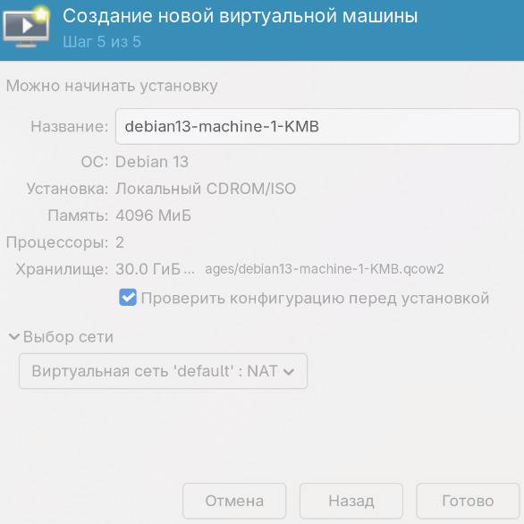

# 🔧 Задание 0 (Установка и настройка PostgreSQL 16 с использованием Ansible)

Tasks:

    0.0. Воткнуть дополнительный диск в вашу виртуалку (но можно просто выделить партицию на текущем диске) в качестве отдельного диска под данные базы;
    0.1. установить postgresql.

*Руками проинициализировать инстанс БД с данными в папке /pg_data/16/*

---
# Установка и настройка PostgreSQL 16 с использованием Ansible (документация)

## 📋 Содержание

1. [Введение](#1-введение)
2. [Подготовка инфраструктуры](#2-подготовка-инфраструктуры)
3. [Настройка дисков](#3-настройка-дисков)
4. [Подготовка проекта Ansible](#4-подготовка-проекта-ansible)
5. [Настройка Ansible Vault](#5-настройка-ansible-vault)
6. [Конфигурационные файлы](#6-конфигурационные-файлы)
7. [Playbook для установки PostgreSQL](#7-playbook-для-установки-postgresql)
8. [Запуск и проверка](#8-запуск-и-проверка)
9. [Устранение неполадок](#9-устранение-неполадок)
10. [Контрольный чек-лист](#10-контрольный-чек-лист)

---

## 1. Введение

В данном руководстве описана полная установка PostgreSQL 16 на два сервера с использованием Ansible. Особое внимание уделено:

- Использованию отдельного диска для данных БД (`/pg_data`)
- Безопасному хранению паролей через Ansible Vault
- Автоматизации всех этапов настройки

### Требования

| Компонент | Требование |
|-----------|------------|
| ОС | Debian 13 |
| Количество серверов | 2 |
| Ansible | Установлен на управляющей машине |
| SSH | Доступ к серверам по ключу |
| Диск | Дополнительный диск для данных БД |


---

## 2. Подготовка инфраструктуры

### 2.1. Server1 - Установка с нуля

При установке Debian на первый сервер добавьте второй диск для данных PostgreSQL.

**Шаг 1:** На этапе разбиения дисков выберите ручное разбиение (Manual partitioning)

**Шаг 2:** Настройте первый диск (`/dev/vda`) для системы:

| Точка монтирования | Размер | Тип |
|-------------------|--------|-----|
| `/boot/efi` | 512 MB | EFI System Partition |
| `/boot` | 1 GB | ext2 |
| `[SWAP]` | 2 GB | swap |
| `/` | 20 GB | ext4 |


Рисунок 2 - Разбиение системного диска

*На рисунке выше показана структура разделов на системном диске.*


**Шаг 3:** На втором диске (`/dev/vdb`)  - создадим раздел /pg_data.

*Как показано на скриншоте.*

---

### 2.2. Server2 - Ручное добавление диска

На втором сервере Debian уже установлен. Добавим второй диск и создадим файловую систему.

**Шаг 1:** Подключитесь к серверу и проверьте доступные диски:

```bash
lsblk
```

📋 Итог
✅ PostgreSQL 16 установлен и настроен
✅ Данные хранятся в /pg_data/16/ (на смонтированном диске)
✅ Служба запущена и в автозагрузке
✅ Пароль установлен и работает
✅ Vault интегрирован для безопасного хранения секретов
✅ Playbook идемпотентен (можно запускать повторно)
---
**Главный редактор и будущий devops-ер:** Товпеко Глеб Вадимович, группа K0109-23
