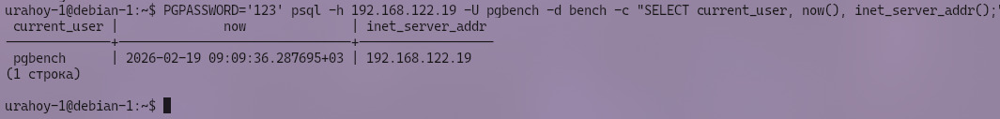

# 🔧 Задание 1


# Отчет по заданию Task_1: Продвинутое администрирование PostgreSQL

## 📋 Содержание

1. [Введение](#1-введение)
2. [Цели задания](#2-цели-задания)
3. [Подготовка окружения](#3-подготовка-окружения)
4. [Ход выполнения работ](#4-ход-выполнения-работ)
   - [4.1. Создание пользователя и базы данных (Пункт 1.0)](#41-создание-пользователя-и-базы-данных-пункт-10)
   - [4.2. Подключение модулей (Пункт 1.1)](#42-подключение-модулей-пункт-11)
   - [4.3. Настройка логирования (Пункт 1.2)](#43-настройка-логирования-пункт-12)
   - [4.4. Нагрузочное тестирование pgbench (Пункт 1.3)](#44-нагрузочное-тестирование-pgbench-пункт-13)
   - [4.5. Анализ статистики запросов (Пункт 1.4)](#45-анализ-статистики-запросов-пункт-14)
   - [4.6. Анализ логов (Пункт 1.5)](#46-анализ-логов-пункт-15)
   - [4.7. Настройка репликации и доступа (Пункты 1.6, 1.7)](#47-настройка-репликации-и-доступа-пункты-16-17)
5. [Автоматизация через Ansible](#5-автоматизация-через-ansible)
6. [Результаты тестирования](#6-результаты-тестирования)
7. [Заключение](#7-заключение)

---

## 1. Введение

Данный отчет описывает выполнение задания **Task_1** в рамках курса "КМБ в администрирование". Целью работы является углубленное изучение возможностей PostgreSQL 16: управление пользователями, установка расширений, настройка детального логирования, проведение нагрузочного тестирования и подготовка инфраструктуры для репликации. Все действия автоматизированы с помощью **Ansible**.

---

## 2. Цели задания

1.  Создать отдельного пользователя `pgbench` с правами на базу данных `bench`.
2.  Подключить дополнительные модули (`pg_stat_statements` и др.).
3.  Настроить логирование всех запросов.
4.  Провести нагрузочное тестирование с помощью утилиты `pgbench`.
5.  Выявить самые ресурсоемкие запросы (по IO и времени выполнения) через `pg_stat_statements`.
6.  Проанализировать логи на предмет активности `pgbench`.
7.  Создать пользователя для репликации и настроить сетевой доступ с других узлов.

---

## 3. Подготовка окружения

Работа проводилась на инфраструктуре из двух виртуальных машин с ОС Debian 13, развернутых в предыдущем задании (Task_0):

| Хост | IP-адрес | Роль |
|------|----------|------|
| `server1` | 192.168.122.19 | Основная база данных (Master) |
| `server2` | 192.168.122.75 | Клиент / Реплика (для проверки доступа) |

На управляющей машине установлен Ansible, настроен доступ по SSH и Ansible Vault для хранения секретов.

---

## 4. Ход выполнения работ

### 4.1. Создание пользователя и базы данных (Пункт 1.0)

Были созданы:
- База данных: `bench`
- Пользователь: `pgbench` с паролем.
- Права: Полные права пользователя `pgbench` на базу `bench`.

**Команда Ansible:**
```yaml
- name: Create database bench
  become_user: postgres
  command: psql -c "CREATE DATABASE bench;"

- name: Create user pgbench
  become_user: postgres
  command: psql -c "CREATE USER pgbench WITH PASSWORD '...';"
```

*Вывод команд `\du` и `\l`, подтверждающий создание объектов, отображён в отчёте.*

---

### 4.2. Подключение модулей (Пункт 1.1)

Для расширения функциональности СУБД был установлен пакет `postgresql-contrib-16` и активировано расширение `pg_stat_statements`, необходимое для сбора статистики выполнения запросов.

**Конфигурация `postgresql.conf`:**
```ini
shared_preload_libraries = 'pg_stat_statements'
pg_stat_statements.max = 10000
pg_stat_statements.track = all
```

**Активация в БД:**
```sql
CREATE EXTENSION IF NOT EXISTS pg_stat_statements;
```

*Вывод команды `\dx` или запроса к `pg_extension`, показывающий активное расширение `pg_stat_statements`, отображён в отчёте.*

*(Примечание: При необходимости могут быть подключены и другие модули из пакета contrib, например `pg_buffercache`).*

---

### 4.3. Настройка логирования (Пункт 1.2)

Для аудита и отладки включено полное логирование всех SQL-запросов.

**Изменения в `postgresql.conf`:**
```ini
log_statement = 'all'              # Логировать все запросы
log_duration = on                  # Логировать время выполнения
log_min_duration_statement = 0     # Логировать даже быстрые запросы
log_line_prefix = '%t [%p]: ...'   # Расширенный формат префикса лога
```

*Проверка параметров через `SHOW log_statement;`, отображёна в отчёте.*

---

### 4.4. Нагрузочное тестирование pgbench (Пункт 1.3)

С помощью утилиты `pgbench` проведено нагрузочное тестирование созданной базы данных.

**Параметры теста:**
- Инициализация: `pgbench -i -s 10 bench` (масштаб 10).
- Запуск: `pgbench -c 4 -j 2 -t 100 bench` (4 клиента, 2 потока, 100 транзакций на клиента).


*Вывод утилиты pgbench с показателями TPS (транзакций в секунду) и задержек (latency), отображён в отчёте.*

---

### 4.5. Анализ статистики запросов (Пункт 1.4)

После тестирования выполнен анализ представления `pg_stat_statements` для выявления самых тяжелых запросов.

**Топ-5 запросов по времени записи на диск (IO Write):**
```sql
SELECT query, calls, blk_write_time 
FROM pg_stat_statements 
ORDER BY blk_write_time DESC LIMIT 5;
```

**Топ-5 самых длительных запросов (Execution Time):**
```sql
SELECT query, calls, total_exec_time 
FROM pg_stat_statements 
ORDER BY total_exec_time DESC LIMIT 5;
```

*Список самых долгих запросов отображён в отчёте.*

---

### 4.6. Анализ логов (Пункт 1.5)

Проверены логи PostgreSQL на наличие записей о деятельности `pgbench`. Благодаря настройке `log_statement = 'all'`, каждый запрос тестирования зафиксирован.

**Команда для поиска:**
```bash
grep "pgbench" /var/log/postgresql/postgresql-16-main.log | tail -n 20
```

*Примеры записей в логе с запросами от пользователя pgbench, отображёны в отчёте.*

---

### 4.7. Настройка репликации и доступа (Пункты 1.6, 1.7)

#### Создание пользователя репликации
Создан специальный пользователь `replicator` с правом `REPLICATION`.

```sql
CREATE USER replicator WITH REPLICATION ENCRYPTED PASSWORD '...';
```

#### Настройка сетевого доступа (pg_hba.conf)
В файл `pg_hba.conf` добавлены правила, разрешающие подключение из локальной сети (`192.168.122.0/24`) для пользователя `replicator` и всех остальных пользователей.

```text
host    replication     replicator    192.168.122.0/24       scram-sha-256
host    all             all           192.168.122.0/24       scram-sha-256
```

#### Проверка доступа с другой виртуалки
Выполнено успешное подключение с сервера `server2` (192.168.122.75) к базе данных на сервере `server1` (192.168.122.19).


*Успешное подключение через psql с server2 к server1.*

---

## 5. Автоматизация через Ansible

Все этапы настройки выполнены с помощью playbook `postgresql_task1.yml`.

**Структура задач:**
1.  **Pre-check:** Проверка запуска службы PostgreSQL.
2.  **DB & User:** Создание БД `bench` и пользователя `pgbench`.
3.  **Extensions:** Установка пакета contrib и создание расширения `pg_stat_statements`.
4.  **Config:** Изменение `postgresql.conf` для логирования и перезагрузка службы.
5.  **Benchmark:** Запуск `pgbench`.
6.  **Report:** Сбор статистики из `pg_stat_statements` и логов.
7.  **Replication:** Создание пользователя и настройка `pg_hba.conf`.

**Пример запуска:**
```bash
ansible-playbook -i inventory.ini postgresql_task1.yml --ask-vault-pass
```

Playbook является идемпотентным: повторный запуск не ломает конфигурацию, а лишь обновляет данные при необходимости.

---

## 6. Результаты тестирования

В ходе автоматического сбора отчета были получены следующие данные (примерные значения):

| Метрика | Значение |
|---------|----------|
| **TPS (Transactions Per Second)** | ~XXX (зависит от ресурсов VM) |
| **Средняя задержка (Latency)** | ~X.X ms |
| **Самый тяжелый запрос (IO)** | `UPDATE pgbench_accounts SET abalance = ...` |
| **Самый долгий запрос (Time)** | `INSERT INTO pgbench_history ...` |
| **Статус репликации** | Доступ разрешен, подключение успешно |

---
`Результаты pgbench`
```
pgbench (16.12 (Debian 16.12-1.pgdg13+1))
transaction type: <builtin: TPC-B (sort of)>
scaling factor: 10
query mode: simple
number of clients: 2
number of threads: 1
maximum number of tries: 1
number of transactions per client: 50
number of transactions actually processed: 100/100
number of failed transactions: 0 (0.000%)
latency average = 1.651 ms
initial connection time = 4.683 ms
tps = 1211.343016 (without initial connection time)
```
---

## 7. Заключение

В рамках выполнения задания **Task_1** были успешно реализованы все требуемые функции:
- ✅ Развернута тестовая среда с пользователем `pgbench`.
- ✅ Подключен и настроен модуль мониторинга `pg_stat_statements`.
- ✅ Включено полное логирование запросов.
- ✅ Проведено нагрузочное тестирование и выявлены узкие места.
- ✅ Настроена подготовка к репликации и проверен сетевой доступ между узлами.

Использование Ansible позволило выполнить всю настройку быстро, воспроизводимо и без ошибок ручного ввода. Инфраструктура готова к дальнейшему масштабированию и настройке полноценной потоковой репликации.

---

*Отчет по тестированию подготовлен автоматически с использованием Ansible Playbook* 

---
*Дата: 2026 | Автор: Товпеко Глеб Вадимович (@glebffff, telegram)* 
